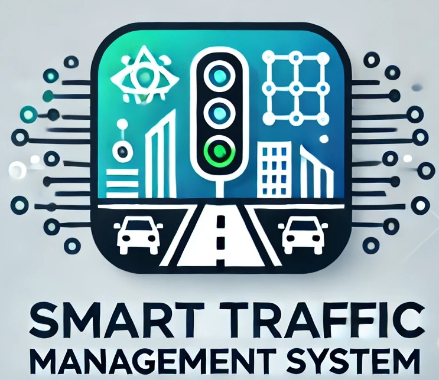

# Smart-Traffic-Management-System

  
 

This project uses Artificial Intelligence (AI), OpenCV, cryptocurrencies, NFC and smart sensors to optimize urban traffic management. The system analyzes vehicle flow in real time, adapts traffic lights and collects data on pollution and weather conditions for more efficient and sustainable traffic.

### Main features:

✅ Video analysis with OpenCV – vehicle, pedestrian detection and license plate recognition

✅ AI for optimization – automatic adjustment of traffic lights based on traffic and weather conditions

✅ Cryptocurrency and NFC payments – automatic toll collection for roads, parking lots or areas with heavy traffic

✅ Pollution monitoring – noxious gas sensors to measure air quality

✅ Weather detection – rain and humidity sensors to adapt traffic light times

### 🔧 Technologies used:

Microcontrollers: Raspberry Pi 5

Software: OpenCV, Python, C++

Sensors: LIDAR, IR, noxious gas sensors, rain, humidity

Communication: Wi-Fi

Blockchain & Crypto: Integration for secure payments

This system contributes to smoother traffic, reduced pollution and increased road safety.
### License
**Copyright © 2007 Free Software Foundation.**

Everyone is permitted to copy and distribute verbatim copies of this license document, but changing it is not allowed.
